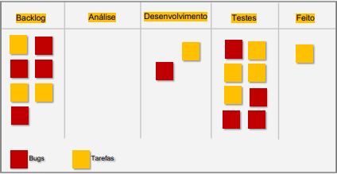

### O profissional de Qualidade e suas habilidades
    
    O profissional de Qualidade e suas habilidades
    
    - Quality analyst x Quality Assurence
    - Quais suas as atribuiçoes e reponsabilidades
    
    Soft Skills
    
    - principais soft skills[5]
    - importância da soft skill
    - principais soft skill de um QA[14]
    
    Hard skills
    
    - Metodologias ágeis
    - Cultura DevOps
    - Multidisciplinar
    - Entendimento de objetivos de negócio
    - Padrões e Práticas de desenvolvimento
    - Identificação de problemas
    - Linguagens e frameworks de
    programação
    - Automação de testes
    - Tipos e estratégias de testes
    - Testes de Segurança
    - Testes de Performance
    - Métricas de qualidade
    - Banco de Dados
    - Outros conhecimentos de tecnologia
    e processos de qualidade.
    
    PDI
    
    - 5W2H
    - Pirâmide de Glausser
    
     
    
- Módulo 2 - Qualidade de Software e Network
    
    O que é qualidade e como ela é percebida
    
    - Cícero empunhou o que significa Qualidade;
    - Normas que definem qualidade: ISO, ISTQB, ISO/IEC 9126
    - Nomes que falam sobre o que é qualidade: Roger S. Pressman, Martin Fowler
    - qualidade subjetiva: ex: mais caro, melhor a qualidade.
    - qualidade percebida = satisfação do cliente. “NPS”
    
    O que é garantia da qualidade
    
    - Garantia de qualidade: processos para criar as
    entregas
    - Controle de qualidade: realizado depois que o trabalho foi
    completado e a entrega foi criada
    - responsabilidade: determina e monitora os meios para garantir a qualidade do  software
    
    Benefícios para se investir em qualidade
    
    - Custo desnecessário
    - um bug pode custar ate 1000x
    - o que mais importa é o foco no cliente
    
    Padrões de qualidade
    
    - um modelo, método
    - **quantitativos** apresentam os números que comprovam os objetivos
    - **qualitativos** compreender a complexidade das informações.
    - padrões internacionais: ISO, IEEE
    - ABNT
    
    Network
    
    - relacionamento profissional com troca de informações
    
    Github
    
- Módulo 3 - Fundamentos do teste
    
    O que é teste de software
    
    - Determina que estes satisfazem os
    requisitos especificados, para demonstrar
    que são adequados para o propósito e para
    detectar defeitos.
    - 7 principios
    
    Tipos de testes 
    
    - caixa preta
    - funcionais
    - nao-funcionais
    - caixa branca
    - confirmação e regressão
    - automatizados
    
    Fases de teste
    
    - componentes(unidade) → integração → sistema → aceitação
    - exploratórios
    
    Bugs
    
    - erros → ação humana
    - defeito → dados incorretos, clima, inseto
    - falha → resultado aprentado
    - Como reportar e acompanhar um bug
        - quando reportar
            
            durante todo o ciclo de desenvolviomento
            
        - o que deve conter no reporting
            - id / titulo
            - Descrição ou resumo
            - Ambiente / URL
            - Evidências / fotos / prints
            - Passo a passo
            - resultado esperado
        - Opcionais do reporting
            - Niveis de gravidade
            - Prioridade
            - criado por
            - atribuido para:
        
        | ID: | 
          O que é isto?
           |
        | --- | --- |
        | Título: | 
          Este é um modelo de relatório de
          bug. Você deve usar para comunicar um defeito ou melhoria para o seu time de desenvolvimento.
           |
        | Ambiente: | 
           
           |
        | URL: | 
          Como eu uso
          isto?
           |
        | Evidências: | 
          Faça uma cópia deste documento
          (Arquivo> Fazer uma cópia) e salve-o para uso futuro. 
          Este arquivo tem um exemplo de
          escrita de cada campo, mas você pode substituir de acordo com sua
          necessidade. 
           |
        | Etapas para reproduzir: |  |
        | Resultado e comportamento esperado: | 
         |
        | Gravidade: |  |
        | Prioridade: |  |
        | Data e hora: |  |
        | Criado por: |  |
        | Atribuído para: |  |
        
        **O que é isto?**
        
        ---
        
        ---
        
        ---
        
        **Como eu uso isto?**
        
        ---
        
        ---
        
        [REPORTING (1)](https://www.notion.so/30e5431df55540c2ae81bbb71fbc64af)
        
- Módulo 4 - Técnicas de testes
    - Sete princípios de teste
        - O teste mostra a presença de defeitos e não a sua ausência
        - Testes exaustivos são impossíveis
        - O teste inicial economiza tempo e dinheiro
        - Defeitos se agrupam
        - Cuidado com o paradoxo do pesticida
        - O teste depende do contexto
        - Ausência de erros é uma ilusão
    - Parcionamento de equivalência
        
        É uma tecnica de teste de caixa preta que consistem em parcionar os casos de testes em dados validos e invalidos
        
    - Valor limite
        
        Primeiro e último valor de uma partição são seus valores limites
        
        <aside>
        📌 Permitir cadastro apenas das 9 as 18 horas
        
        | teste 1 | cadastrar aluno as 8:59 | inválido |
        | --- | --- | --- |
        | teste 2 | cadastrar aluno as 9:00 | válido |
        | teste 3 | cadastrar aluno as 9:01 | válido |
        | teste 4 | cadastrar aluno as 17:59 | válido |
        | teste 5 | cadastrar aluno as 18:00 | válido |
        | teste 6 | cadastrar aluno as 18:01 | inválido |
        </aside>
        
        ---
        
    - Tabela de decisão
        
        
        
        
        
        
        
    - Transição de estado
        
        
        
        
        
    
     
    
- Módulo 5 - Planejamento e estratégia de teste
    - Testes baseados em experiência
        - Suposição de erro
        - Teste explorarório
        - Teste baseado em Checklist
            - Planilha
            - Mind Map
        - Verificação e validação
        
        
        
    - Casos de uso
        
        
        
        
        
        - caminho feliz
        - fluxos alternativo
        
        
        
        
        
    - Plano de teste
        
        
        
        Planejamento ⇒ Cenário de teste ⇒ Plano de teste ⇒ 
        
        Casos de teste
        
        
        
    - Estratégia de teste
        1. Diretriz
            
            
            
        2. Documente tudo
        
    - Análise de risco
        - o que é?
        - fatores que influenciam[3]
        - matriz de risco(ideia clip)
        
- Módulo 6 - Metodologias ágeis e Teste ágil
    - MINDSET, 4 valores, 12 principios, práticas
    - Scrum
        - transparencia, Inspeção, adaptação
        - PO, Scrum, Dev. team
        - fiz um mapa mental para entender as Metodologias ágeis e Teste ágil https://miro.com/app/live-embed/uXjVPknrHZY=/?moveToViewport=-53,-474,1212,613&embedId=297775995379

# Fluxo de trabalho do ágil

- Integrantes
    - Team dev.
    - Stakeholders
    - Apoiadores
- Pré-jogo / Sprint 1
- Definition of Ready (DoR)
- Definition of Done (DoD)
- Planning
    - Planning poker
    - T-Shirt Size
- Daily
    - 15m - em pé
    - Gráfico de Burndown
- Review
    - Demonstrar os critérios de aceitação
    - *Showtime*
- Restrospective
    - quadro físico - representação simbólica
    - funretrospectives
- Refinamento Backlog
    - melhorar a proxima sprint
- MVP
    - produto com minimo de recursos possiveis
    - validar hipótese
- Métricas Ágeis
    - Burndown
        - Sprint
        - Épico
    - Velocidade
    - Gráfico de controle
    - Diagrama de fluxo cumulativo
        - concluido x à fazer
    - Criado vs Resolvido
    

## Exercício

Análise do Kanban

1. Quais os problemas você enxerga neste quadro?
Liste pelo menos um problema por coluna (backlog, análise,
desenvolvimento, testes, feito)
2. Quais as possíveis soluções?

Soluções:

- Criar cenários de testes, baseado nos
critérios de aceitação;
- Levantamento de massa de dados;
- Fazer o planejamento dos testes (word,
planilha ou mind map);
- Divisão das tarefas (subtasks);
- Divisão dos testes automatizados (unit,
integration, ui);

# Técnicas de teste Ágil

- Tribo
    - Squads
    - Capitulo
- Shift Left Testing
- XP
    - Pair Program → Pareamento
- Pirâmide de testes
    - Unidade → Integração → UI → Manual
    - Evitar Cu
